<div align="center">
  
  <h1>A.T.L.A.S.</h1>
  <p><b>Autonomous Trust Layer for AI Systems</b></p>
  <p><em>The Future of the Agent-to-Agent (A2A) Economy powered by Tether WDK and Account Abstraction (ERC-4337)</em></p>
</div>

---

## 🌟 The Vision (Hackathon Galáctica: WDK Edition)

**A.T.L.A.S.** is more than just a wallet. It is the core of an economy where Artificial Intelligence Agents buy, sell, and negotiate services **among themselves** in a 100% autonomous way, without human intervention.

Built to dazzle at the **Hackathon**, this project demonstrates how an AI (LLM) can take control of a **Smart Account (WDK)**, request a quote in the marketplace, sign a transaction paid entirely in USDt (*Gasless*), and consume a financial data API... all of this while you observe its "thoughts" live from a real-time Glassmorphism React Dashboard.

---

## 🚀 Core Features

- 🤖 **ReAct AI Reasoning Engine:** The *Client Brain* uses Google Gemini through the OpenAI Function Calling SDK standard. By giving it a natural language prompt (*"Buy me gold data if it's cheap"*), the AI physically invokes tools to interact with the blockchain.
- ⚖️ **Autonomous Market Arbitrage:** If there are multiple providers selling the same service, the LLM reads the market, evaluates the cost/benefit ratio, and selects the optimal service (Arbitrage), natively ignoring more expensive providers or scams.
- 💸 **Smart Revenue Split (Autonomous Treasury):** To demonstrate advanced WDK commerce design, the Seller Agent is programmed to collect taxes autonomously. For every payment received, it mathematically calculates 10% and executes a second ERC-4337 transaction in the background, sending "Royalties" to the Creators' wallet.
- 🛡️ **AI Safety Guardrails (Spending Limits):** The biggest risk of LLMs is financial hallucination. A.T.L.A.S. implements rigid *Guardrails* at the tool level. If the AI attempts to spend more than the established limit (e.g., 0.50 USDt), the physical payment tool automatically blocks the cryptographic signature and returns an error to the AI, ensuring it never drains the Smart Account.
- ⛽ **Gasless WDK Transactions (ERC-4337):** Forget about ETH. The Agents use the official `@tetherto/wdk-wallet-evm-erc-4337` SDK, allowing transaction fees to be subsidized by a Paymaster (Pimlico) on the Sepolia network. Charged and settled solely in USDt.
- 📜 **Immutable Enterprise Audit Trail:** Every thought, reasoning, and physical action of the Agent on the blockchain is recorded locally in `audit_trail_log.txt` with UTC Timestamps, crucial for corporate compliance and auditing of AI decisions.
- 🎨 **Premium Real-Time Dashboard (WebSockets):** Graphic interface developed in React + Vite. It uses `socket.io` to transmit the server log and show in real-time the WDK Wallet balance and the AI's *Stream of Consciousness* and logical reasoning (Tools/Thoughts).
- 🔁 **Autonomous Resilience:** The Seller Agent server has an infinite life cycle (`while(true)`) resistant to crashes, and the Client Agent AI engine implements automatic *Exponential Backoff* protection to evade network or API rate limit failures.
- 🐾 **Portable Skills (OpenClaw Compliance):** The project implements the `SKILL.md` standard. This allows any compatible AI to instantly "learn" to interact with our A2A economy, perform gasless payments, and consume financial microservices without prior configuration.

---

## 🏗️ Project Technical Architecture

The economy is sustained by **3 interconnected pillars**:

1. **The Seller (`provider.ts`):** A Node.js script in a continuous loop that injects its commercial offer into `marketplace.json`, generates invoices (`invoice.json`), and iteratively waits for cryptographic confirmations on the Blockchain (*Settlement* Phase).
2. **The Brain / Client (`client.ts`):** An Express Node.js server with Socket.io. It contains the buyer's Smart Account. It analyzes the human request, reasons using the LLM, uses its WDK *Tools* to spend funds, and delivers the data.
3. **The Visualizer (`React App`):** Your command console at port `:5173`. Through it, you pass human instructions to the LLM server and see how money moves transparently.

### Agent-to-Agent (A2A) Negotiation and Intelligence Flow:

```mermaid
sequenceDiagram
    participant UI as Dashboard (React)
    participant Client as Buyer Agent (LLM)
    participant MP as Local Files (JSON)
    participant Prov as Seller Agent

    Prov->>MP: 1. Registers XAU₮ Offer
    UI->>Client: Prompt: "Buy gold data"
    
    rect rgb(30, 40, 50)
        Note over Client,MP: AI Reasoning Zone (ReAct)
        Client->>MP: 2. readMarketplace()
        MP-->>Client: Returns prices
        Client->>Prov: 3. requestInvoice()
        Prov-->>Client: emits invoice.json
        Client->>Client: Analyzes WDK balance
    end

    rect rgb(10, 45, 20)
        Note over Client,Prov: WDK Account Abstraction Execution (ERC-4337)
        Client->>Prov: 4. executeGaslessPayment()
        Note over Client,Prov: Transaction signed without Gas (Sepolia USDt)
    end

    Prov->>Prov: 5. Validates TX On-Chain
    Prov-->>Client: 6. getFulfillmentData() (JSON with Data)
    Client-->>UI: 7. Emits Final [AGENT THOUGHT] via WebSockets
```



---

## 🛠️ Tech Stack

- **Tether WDK:** `@tetherto/wdk`, `@tetherto/wdk-wallet-evm-erc-4337`.
- **Artificial Intelligence:** LLM Core Engine (Google Gemini / OpenAI compatible SDK).
- **Backend / Networking:** Node.js, Express.js, Socket.io, TypeScript (`tsx`).
- **Frontend UI:** Vite, React, Lucide-React, Vanilla CSS (Glassmorphism & Neon Design).
- **Blockchain:** Ethereum Sepolia Testnet, MOCK USDt.

---

## 💻 Quick Start: Launch the A2A Economy in Minutes

To see the magic in action, make sure you have `Node.js` (v20+) installed and follow these steps by opening **three different terminals**:

### Step 1: Configure Credentials
Rename or create your `.env` file in the project root and add your seeds and LLM API KEY:
```env
CLIENT_SEED="witch table dog camel..."
PROVIDER_SEED="cat sun moon flower..."
GEMINI_API_KEY="AIzaSy... (Your free Google AI Studio key)"
```

### Step 2: Start the Seller (Terminal 1)
We start the shop, which will wait for clients.
```bash
npm install
npm run provider
```

### Step 3: Start the Client Brain (Terminal 2)
We start the buyer AI Agent and its WebSocket server at port `:3000`.
```bash
npm run client
```

### Step 4: Start the Dashboard UI (Terminal 3)
We start the spectacular graphic interface at port `:5173`.
```bash
cd frontend
npm install
npm run dev
```

> **Action!** → Open `http://localhost:5173` in your browser. Click **Deploy Agent** and watch the graphic terminal flow as agents negotiate and WDK Account Abstraction payments are confirmed on-chain *Gasless*.

---
<div align="center">
  <p><em>Developed with ❤️ for the Tether Ecosystem.</em></p>
  <p><a href="https://youtu.be/es6vM40BcPA" target="_blank">Ver video en YouTube</a></p>
</div>
