<div align="center">
  
  <h1>A.T.L.A.S.</h1>
  <p><b>Autonomous Task Learning and Assistance System</b></p>
  <p><em>El Futuro de la Economía Agente-a-Agente (A2A) impulsado por Tether WDK y Account Abstraction (ERC-4337)</em></p>
</div>

---

## 🌟 La Visión (Hackathon Galáctica: WDK Edition)

**A.T.L.A.S.** no es solo una billetera. Es el núcleo de una economía donde los Agentes de Inteligencia Artificial compran, venden y negocian servicios **entre ellos** de forma 100% autónoma y sin la intervención humana. 

Construido para deslumbrar en el **Hackathon**, el proyecto demuestra cómo una IA (LLM) puede tomar el control de una **Smart Account (WDK)**, pedir un presupuesto en el mercado, firmar una transacción pagada íntegramente en USDt (*Gasless*) y consumir una API de datos financieros... todo esto, mientras observas sus "pensamientos" en vivo desde un Dashboard React Glassmorphism en tiempo real.

---

## 🚀 Características Principales (Core Features)

- 🤖 **Motor de Razonamiento ReAct AI:** El *Cerebro Cliente* usa Google Gemini a través del estándar OpenAI Function Calling SDK. Al darle un prompt en lenguaje natural (*"Cómprame datos del oro si están baratos"*), la IA invoca físicamente herramientas para interactuar con la cadena de bloques.
- ⚖️ **Arbitraje de Mercado Autónomo:** Si existen múltiples proveedores que venden lo mismo, el LLM lee el mercado, evalúa la relación costo/beneficio y selecciona el servicio óptimo (Arbitraje), ignorando de forma nativa a los proveedores más caros o estafas.
- 💸 **Smart Revenue Split (Tesorería Autónoma):** Para demostrar un diseño avanzado de comercio WDK, el Agente Vendedor está programado para cobrar impuestos autónomamente. Por cada pago recibido, calcula matemáticamente el 10% y ejecuta una segunda transacción ERC-4337 en segundo plano enviando "Regalías" a la billetera de los Creadores. 
- 🛡️ **AI Safety Guardrails (Límites de Gasto):** El Mayor riesgo de los LLMs es la alucinación financiera. A.T.L.A.S. implementa *Guardrails* rígidos a nivel de herramienta. Si la IA intenta gastar más del límite establecido (ej. 0.50 USDt), la herramienta física de pago bloquea la firma criptográfica automáticamente y le devuelve un error a la IA, asegurando que nunca drene la Smart Account.
- ⛽ **Transacciones WDK *Gasless* (ERC-4337):** Olvídate del ETH. Los Agentes usan el SDK oficial `@tetherto/wdk-wallet-evm-erc-4337`, permitiendo que las comisiones por transacciones sean subsidiadas por un Paymaster (Pimlico) en la red Sepolia. Cobrado y liquidado únicamente en USDt.
- 📜 **Enterprise Audit Trail Inmutable:** Cada pensamiento, razonamiento, y acción física del Agente en la cadena de bloques se registra localmente en `audit_trail_log.txt` con Timestamp UTC, crucial para el cumplimiento y auditoría corporativa de las decisiones de la IA.
- 🎨 **Dashboard Real-Time Premium (WebSockets):** Interfaz gráfica desarrollada en React + Vite. Usa `socket.io` para transmitir el log del servidor y mostrar en tiempo real el saldo de la Billetera WDK y el *Stream de Consciencia* y razonamiento lógico de la IA (Tools/Pensamientos).
- 🔁 **Resiliencia Autónoma:** El servidor del Agente Proveedor cuenta con un ciclo de vida infinito (`while(true)`) resistente a caídas, y el motor IA del Agente Cliente implementa protección *Exponential Backoff* automática para evadir fallos de red o de tarifa API limit.
- 🐾 **Integración Nativa con OpenClaw:** Cumple el estándar requerido, desplegando un archivo `SKILL.md` capaz de enseñar a los agentes de IA a interactuar de forma segura con los contratos WDK.

---

## 🏗️ Arquitectura Técnica del Proyecto

La economía se sostiene mediante **3 pilares interconectados**:

1. **El Vendedor (`provider.ts`):** Un script de Node.js en loop continuo que inyecta su oferta comercial en `marketplace.json`, genera facturas (`invoice.json`), y espera iterativamente confirmaciones criptográficas en la Blockahin (Fase *Settlement*).
2. **El Cerebro / Cliente (`client.ts`):** Un servidor Express Node.js con Socket.io. Contiene la Smart Account compradora. Analiza la petición del humano, razona usando el LLM, usa sus *Tools* WDK para gastar fondos y entrega los datos.
3. **El Visualizador (`React App`):** Tu consola de mando en el puerto `:5173`. A través de ella pasas instrucciones humanas al servidor LLM y ves cómo el dinero se mueve de forma transparente.

### Diagrama de Flujo de Negociación (A2A) e Inteligencia:

```mermaid
sequenceDiagram
    participant UI as Dashboard (React)
    participant Cliente as Agente Comprador (LLM)
    participant MP as Archivos Locales (JSON)
    participant Prov as Agente Vendedor

    Prov->>MP: 1. Registra Oferta XAU₮
    UI->>Cliente: Prompt: "Compra datos de oro"
    
    rect rgb(30, 40, 50)
        Note over Cliente,MP: Zona de Razonamiento IA (ReAct)
        Cliente->>MP: 2. readMarketplace()
        MP-->>Cliente: Retorna precios
        Cliente->>Prov: 3. requestInvoice()
        Prov-->>Cliente: emite invoice.json
        Cliente->>Cliente: Analiza saldo WDK
    end

    rect rgb(10, 45, 20)
        Note over Cliente,Prov: Ejecución WDK Account Abstraction (ERC-4337)
        Cliente->>Prov: 4. executeGaslessPayment()
        Note over Cliente,Prov: Transacción firmada sin Gas (Sepolia USDt)
    end

    Prov->>Prov: 5. Valida TX On-Chain
    Prov-->>Cliente: 6. getFulfillmentData() (JSON con Datos)
    Cliente-->>UI: 7. Emite [AGENT THOUGHT] Final por WebSockets
```



---

## 🛠️ Tech Stack

- **Tether WDK:** `@tetherto/wdk`, `@tetherto/wdk-wallet-evm-erc-4337`.
- **Inteligencia Artificial:** OpenAI SDK + Google Gemini (`gemini-2.5-flash`).
- **Backend / Red:** Node.js, Express.js, Socket.io, TypeScript (`tsx`).
- **Frontend UI:** Vite, React, Lucide-React, Vanilla CSS (Glassmorphism & Neon Design).
- **Blockchain:** Ethereum Sepolia Testnet, MOCK USDt.

---

## 💻 Quick Start: Levanta la Economía A2A en Minutos

Para ver la magia en acción, asegúrate de tener `Node.js` (v20+) instalado y sigue estos pasos abriendo **tres terminales distintas**:

### Paso 1: Configurar Credenciales
Renombra o crea tu archivo `.env` en la raíz del proyecto y agrega tus semillas y tu API KEY de LLM:
```env
CLIENT_SEED="bruja mesa perro camello..."
PROVIDER_SEED="gato sol luna flor..."
GEMINI_API_KEY="AIzaSy... (Tu llave gratuita de Google AI Studio)"
```

### Paso 2: Encender al Vendedor (Terminal 1)
Iniciamos la tienda, que se quedará a la espera de clientes.
```bash
npm install
npm run provider
```

### Paso 3: Encender el Cerebro del Cliente (Terminal 2)
Arrancamos el Agente de IA comprador y su servidor de WebSockets en el puerto `:3000`.
```bash
npm run client
```

### Paso 4: Encender el Dashboard UI (Terminal 3)
Iniciamos la interfaz gráfica espectacular en el puerto `:5173`.
```bash
cd frontend
npm install
npm run dev
```

> **¡Acción!** → Abre `http://localhost:5173` en tu navegador. Presiona **Deploy Agent** y mira la terminal gráfica fluir mientras los agentes negocian y los pagos WDK Account Abstraction se confirman on-chain de forma *Gasless*.

---

## 🏆 Criterios de Evaluación para Jueces

- **Integración WDK (20%):** Altamente compleja, incorporando abstracción de cuentas ERC-4337 usando Pimlico.
- **Inteligencia del Agente (25%):** El uso nativo del patrón ReAct y OpenAPI *Tool Calling* convierte al entorno en un bot verdaderamente inteligente que toma decisiones on-chain basado en prompts.
- **Caso de uso Económico (20%):** Una economía completa (Oferta del servicio, Facturación, Liquidación del dinero y Cumplimiento final) soportada por archivos de mercado asíncronos reales.
- **Experiencia de Usuario (20%):** En lugar de simples logs planos de terminal, se empujó un paso más allá usando WebSockets para empalmar la mente del agente a una UI Premium digna de Hackathons mundiales.
- **Integración OpenClaw (15%):** Archivos `openclaw.tsxt` e instrucciones `SKILL.md` estructuradas en las normas de the *OpenClaw framework*.

<div align="center">
  <p><em>Desarrollado con ❤️ para el Ecosistema Tether.</em></p>
</div>
