<div align="center">
  
  <h1>A.T.L.A.S.</h1>
  <p><b>Autonomous Task Learning and Assistance System</b></p>
  <p><em>The Future of the Agent-to-Agent (A2A) Economy powered by Tether WDK and Account Abstraction (ERC-4337)</em></p>
</div>

---

## 🌟 The Vision (Hackathon Galáctica: WDK Edition)

**A.T.L.A.S.** is not just a wallet. It is the core of a functioning economy where Artificial Intelligence Agents buy, sell, and negotiate services **with each other** 100% autonomously, without human intervention.

Built to shine in the **Hackathon Galáctica**, the project demonstrates how an AI (LLM) can orchestrate a **Smart Account (WDK)**, request quotes from a marketplace, sign a transaction paid entirely in USDt (*Gasless*), and consume financial APIs... all of this while you observe its "stream of consciousness" live from a real-time React Glassmorphism Dashboard.

---

## 🚀 Core Features

- 🤖 **ReAct AI Reasoning Engine:** The *Client Brain* uses Google Gemini through the OpenAI Function Calling SDK standard. Provide a natural language prompt (*"Buy me gold data if it's cheap"*), and the AI will physically invoke tools to interact with the blockchain.
- ⚖️ **Autonomous Market Arbitrage:** If there are multiple providers selling the same service, the LLM reads the market, evaluates the cost/benefit ratio, and selects the optimal service, natively bypassing scammers or overpriced providers.
- 💸 **Smart Revenue Split (Autonomous Treasury):** To demonstrate advanced WDK commerce design, the Provider Agent is programmed to collect taxes autonomously. For every payment received, it mathematically calculates 10% and executes a second background ERC-4337 transaction sending "Royalties" to the Creators' wallet.
- 🛡️ **AI Safety Guardrails:** The highest risk of LLMs is financial hallucination. A.T.L.A.S. implements strict tool-level *Guardrails*. If the AI attempts to spend more than the budget threshold (e.g. 0.50 USDt), the physical payment tool automatically intercepts the cryptographic signature and returns a rejection error to the AI, ensuring it never drains the Smart Account.
- ⛽ **WDK *Gasless* Transactions (ERC-4337):** Forget about ETH. The Agents utilize the official `@tetherto/wdk-wallet-evm-erc-4337` SDK, which allows transaction fees to be fully sponsored by a Paymaster (Pimlico) on the Sepolia network. The agents denominate and settle in USDt exclusively.
- 📜 **Immutable Enterprise Audit Trail:** Every thought, reasoning step, and physical blockchain action executed by the Agent is recorded locally in `audit_trail_log.txt` with a UTC Timestamp, which is crucial for corporate compliance and auditing AI decisions.
- 🎨 **Real-Time Premium Dashboard (WebSockets):** A graphical interface built with React + Vite. It leverages `socket.io` to stream server logs, display live WDK Wallet balances, and visualize the Agent's consciousness (Tools/Thoughts).
- 🔁 **Autonomous Resilience:** The Provider Agent runs an infinite lifecycle (`while(true)`) making it immune to crashes, and the Client AI implements *Exponential Backoff* to naturally evade API Rate Limits.
- 🐾 **OpenClaw Native Integration:** Perfectly fulfills the OpenClaw standard by providing a `SKILL.md` capable of teaching any external AI framework how to securely act upon WDK smart wallets.

---

## 🏗️ Technical Architecture

The A2A economy is sustained by **3 interconnected pillars**:

1. **The Vendor (`provider.ts`):** A continuous Node.js loop script that injects its commercial offer into `marketplace.json`, dynamically generates invoices, and iteratively awaits cryptographic confirmations on the Blockchain (*Settlement* Phase).
2. **The Brain / Client (`client.ts`):** An Express Node.js server with Socket.io. It houses the purchasing Smart Account. It analyzes human requests, reasons utilizing the LLM, invokes WDK *Tools* to spend funds, and processes the delivered data.
3. **The Visualizer (`React App`):** Your command console running on port `:5173`. From here, you push human instructions to the LLM server and witness money flow transparently.

### Agent-to-Agent (A2A) Flow Diagram:

```mermaid
sequenceDiagram
    participant UI as Dashboard (React)
    participant Client as Buyer Agent (LLM)
    participant MP as Local FS (JSON)
    participant Prov as Vendor Agent

    Prov->>MP: 1. Registers XAU₮ Offer
    UI->>Client: Prompt: "Buy me gold data"
    
    rect rgb(30, 40, 50)
        Note over Client,MP: AI Reasoning Zone (ReAct)
        Client->>MP: 2. readMarketplace()
        MP-->>Client: Returns prices
        Client->>Prov: 3. requestInvoice()
        Prov-->>Client: issues invoice.json
        Client->>Client: Analyzes WDK balance & Guardrails
    end

    rect rgb(10, 45, 20)
        Note over Client,Prov: WDK Account Abstraction (ERC-4337)
        Client->>Prov: 4. executeGaslessPayment()
        Note over Client,Prov: Modifies App State & Signs Transaction without Gas (Sepolia USDt)
    end

    Prov->>Prov: 5. Validates TX On-Chain
    Prov-->>Client: 6. getFulfillmentData() (JSON Delivery)
    Client-->>UI: 7. Emits Final [AGENT THOUGHT] via WebSockets
```



---

## 🛠️ Tech Stack

- **Tether WDK:** `@tetherto/wdk`, `@tetherto/wdk-wallet-evm-erc-4337`.
- **Artificial Intelligence:** OpenAI SDK + Google Gemini (`gemini-2.5-flash`).
- **Backend / Network:** Node.js, Express.js, Socket.io, TypeScript (`tsx`).
- **Frontend UI:** Vite, React, Lucide-React, Vanilla CSS (Glassmorphism & Neon Design).
- **Blockchain:** Ethereum Sepolia Testnet, MOCK USDt, Pimlico Paymaster.

---

## 💻 Quick Start: Booting the A2A Economy in Minutes

To see the magic in action, make sure you have `Node.js` (v20+) installed and open **three separate terminals**:

### Step 1: Configure Credentials
Create a `.env` file in the project's root and add your seeds and LLM API KEY:
```env
CLIENT_SEED="witch table dog camel..."
PROVIDER_SEED="cat sun moon flower..."
GEMINI_API_KEY="AIzaSy... (Your free Google AI Studio Key)"
```

### Step 2: Boot the Vendor (Terminal 1)
Start the store, which will eternally listen for clients.
```bash
npm install
npm run provider
```

### Step 3: Boot the Client Brain (Terminal 2)
Start the purchasing AI framework and its WebSocket server on port `:3000`.
```bash
npm run client
```

### Step 4: Boot the UI Dashboard (Terminal 3)
Start the graphical interface on port `:5173`.
```bash
cd frontend
npm install
npm run dev
```

> **Action!** → Open `http://localhost:5173` in your browser. Press **Deploy Agent** and watch the terminal flow as the agents negotiate and process WDK Account Abstraction payments fully *Gasless*.

---

## 🏆 Evaluation Criteria (For Judges)

- **WDK Integration (20%):** Highly complex wallet setup incorporating ERC-4337 account abstraction using Pimlico's infrastructure.
- **Agent Intelligence (25%):** Native use of the ReAct pattern and OpenAPI *Tool Calling*. The environment is truly an intelligent autonomous bot that executes on-chain decisions evaluating dynamically changing states.
- **Economic Soundness / Case (20%):** A full closed-loop economy (Service Offer, Invoicing, Settlement, Fulfillment, Revenue Split Tax) supported by verifiable IPC methods.
- **User Experience (20%):** Stepping away from raw CLI terminals, WebSockets bridge the agent's mind directly to a Premium GUI worthy of a global hackathon.
- **OpenClaw Integration (15%):** `openclaw.tsxt` and `SKILL.md` resources are cleanly structured honoring *OpenClaw framework* standards.

<div align="center">
  <p><em>Developed with ❤️ for the Tether Ecosystem.</em></p>
</div>
